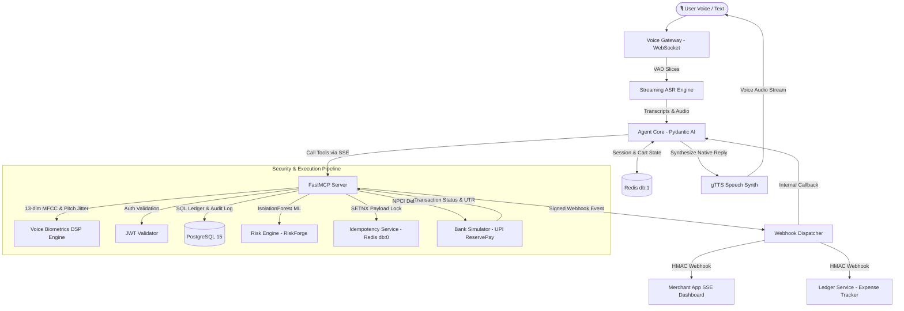

# 🦝 Raccon (`voipay`)

> **Project Codename**: `Raccon` | **Product Name**: `voipay`  
> *Next-Gen Autonomous Voice-Biometric Payment Agent powered by Pydantic AI, FastMCP, Real-Time DSP Liveness Math, and RBI/NPCI Guardrails.*

---

<div align="center">


-8A2BE2?style=for-the-badge)


</div>

---

## 🌟 1. Overview & Innovation

**`voipay`** (built under project codename **`Raccon`**) is a voice-first conversational payment platform that enables secure, voice-driven UPI transactions. It combines real-time **Digital Signal Processing (DSP) voice biometrics**, **deepfake liveness protection**, an **autonomous agent reasoning core**, and a **Model Context Protocol (MCP)** tool execution architecture.

```
                  ┌──────────────────────────────────────────────┐
                  │               🦝 RACCON AGENT               │
                  │   Voice Input ➔ DSP Math ➔ LLM ➔ MCP ➔ NPCI   │
                  └──────────────────────────────────────────────┘
```

### 💡 Core Innovations:
1. **Zero-Latency Voice Biometrics DSP**: Pure mathematical feature extraction (13-dim MFCCs) with volume independence, eliminating reliance on heavy external voice models for baseline verification.
2. **Mathematical Deepfake & Replay Defense**: Autocorrelation pitch-jitter evaluation ($F_0$) combined with spectral energy bound analysis to detect AI voice clones and speaker playback attacks.
3. **Non-Bypassable MCP Guardrails**: Decoupled tool execution where MCP tools independently verify user confirmation in Redis before executing debits—making LLM hallucination or prompt injection attacks impossible.
4. **Passive AI Expense Ledger**: Automated category and nature (**WANT**, **NEED**, **MUST**) tagging from voice payment webhooks, supporting real-time conversational budget queries (*"How much did I spend this week?"*).

---

## 🏗️ 2. System Architecture



---

## 📐 3. Mathematical Innovation (Voice Biometrics & Liveness DSP)

Unlike traditional text systems that rely solely on passwords, `voipay` evaluates human acoustic physics and signal dynamics in real-time.

### A. 13-Dimensional MFCC Vocal Fingerprinting
1. **Mel-Scale Frequency Transformation**: Audio frames are transformed into the frequency domain via FFT and mapped to the human auditory Mel scale.
2. **Gain/Volume Independence**: The 0th coefficient ($c_0$) is discarded to ensure shouting or whispering does not alter the fingerprint vector $\mathbf{v} \in \mathbb{R}^{12}$.
3. **Euclidean Vector Match**:
   $$d(\mathbf{v}_{\text{test}}, \mathbf{v}_{\text{enrolled}}) = \sqrt{\sum_{i=1}^{12} (v_{\text{test}, i} - v_{\text{enrolled}, i})^2}$$
   $$\text{Confidence Score} = \max\left(0, 100.0 - d \times 1.67\right)$$

### B. Deepfake AI Clone Defense (Pitch Jitter Autocorrelation)
Synthetic Voice / Text-to-Speech (TTS) models generate clock-timed, unnaturally flat fundamental pitch frequencies ($F_0$).
$$\text{StDev}(F_0) < 4.0\text{ Hz} \implies \text{Flagged as AI Deepfake Clone}$$

### C. Replay Attack Spectrum Bounds
Physical playback speakers (smartphones, laptops) suffer from hardware frequency attenuation:
$$\text{Energy Ratio}_{\text{Treble}} = \frac{E(f > 7.5\text{kHz})}{E_{\text{total}}} \quad \text{and} \quad \text{Energy Ratio}_{\text{Bass}} = \frac{E(f < 100\text{Hz})}{E_{\text{total}}}$$
Depleted ratios indicate pre-recorded speaker playback.

---

## 🤖 4. Autonomous Agent Architecture (Pydantic AI vs. LangGraph / CrewAI)

We deliberately chose **Pydantic AI** over graph-based frameworks like LangGraph or CrewAI.

| Feature | Pydantic AI (Chosen) | LangGraph / CrewAI |
| :--- | :--- | :--- |
| **Type Safety** | Native Pydantic models & validation | Dict-based state objects |
| **Dependency Injection** | Built-in `RunContext[AgentDeps]` | Manual state graph passing |
| **Execution Overhead** | Zero-graph overhead, ultra-low latency | Multi-node state machine overhead |
| **Deterministic Guardrails** | Strong schema enforcement | Probabilistic agent transitions |

> [!TIP]
> **Why Pydantic AI?** In voice-driven payments, latency is critical. Pydantic AI allows us to run structured tool execution with zero graph traversal overhead while maintaining type-safe dependency injection.

---

## 🔌 5. Model Context Protocol (MCP) Standard

We decoupled payment execution logic into a standardized **FastMCP Server** (SSE Transport).

```
   ┌──────────────────┐           SSE Transport           ┌──────────────────┐
   │ Pydantic AI Core │ ────────────────────────────────> │ FastMCP Server   │
   │ (Reasoning LLM)  │ <──────────────────────────────── │ (Execution Tools)│
   └──────────────────┘                                   └──────────────────┘
                                                                   │
                                                      ┌────────────┴────────────┐
                                                      │ Cryptographic Validation │
                                                      │  - Check Redis Confirm  │
                                                      │  - NPCI Debit Execute   │
                                                      └─────────────────────────┘
```

> [!IMPORTANT]
> **Non-Bypassable Security Architecture**:
> Even if an LLM is subjected to prompt injection or hallucination, the MCP `execute_payment` tool performs a mandatory cryptographic check against Redis for `payment_confirmed == True`. The LLM **cannot** execute debits independently.

---

## 🛡️ 6. Security Measures, Guardrails & RBI / NPCI Compliance

`voipay` strictly adheres to Reserve Bank of India (RBI) and NPCI UPI regulatory guidelines:

- **RBI 2FA / Additional Factor of Authentication (AFA)**:
  - **Factor 1**: Voice Biometrics + Liveness DSP.
  - **Factor 2 (Step-up)**: Interactive 4-digit PIN fallback (`1234`) triggered when voice match is borderline ($70\% - 85\%$).
- **NPCI Transaction Caps & Mandate Limits**: Automatic verification on transactions exceeding ₹5,000.
- **Velocity Limit Fraud Protection**: Blocks accounts initiating $> 5$ payments in under 60 seconds (`risk_engine`).
- **Idempotency & Double-Debit Protection**: Redis `SETNX` locks on SHA-256 payload hashes ensure network retries never double-charge.
- **Cryptographic Webhooks**: Outgoing notifications are signed with `X-Razorpay-Signature` via **HMAC-SHA256**.
- **Auditability**: Every transaction generates a Unique Transaction Reference (**UTR**) and propagates `X-Trace-ID` headers across all microservices.

---

## 🧰 7. Tech Stack

- **Framework**: Python 3.11+, Pydantic AI, FastMCP, FastAPI
- **Data & Caching**: PostgreSQL 15, Redis 7 (db:0 for Idempotency, db:1 for Sessions)
- **Signal Processing**: NumPy, SciPy (FFT, MFCCs, Autocorrelation Pitch Jitter)
- **Machine Learning**: Scikit-Learn (IsolationForest Anomaly Model)
- **Frontend**: HTML5, Vanilla JS, CSS Glassmorphism, WebSockets, Real-time SSE
- **Orchestration**: Docker, Docker Compose

---

## 📈 8. Future Scope & Roadmap

- [ ] **Multi-Speaker Voice Diarization**: Split restaurant bills by identifying multiple distinct speakers in a single audio stream.
- [ ] **On-Device Edge Biometrics (WASM / TFLite)**: Run signal processing directly in the browser/mobile device for 100% offline biometric privacy.
- [ ] **UPI International & Cross-Border FX**: Real-time currency conversions for cross-border UPI payments.
- [ ] **Predictive AI Cashflow Guard**: Proactive warnings when recurring payments might conflict with projected account balance thresholds.

---

<div align="center">

**Built with ❤️ for Razorpay AI Buildathon 2026**

</div>
